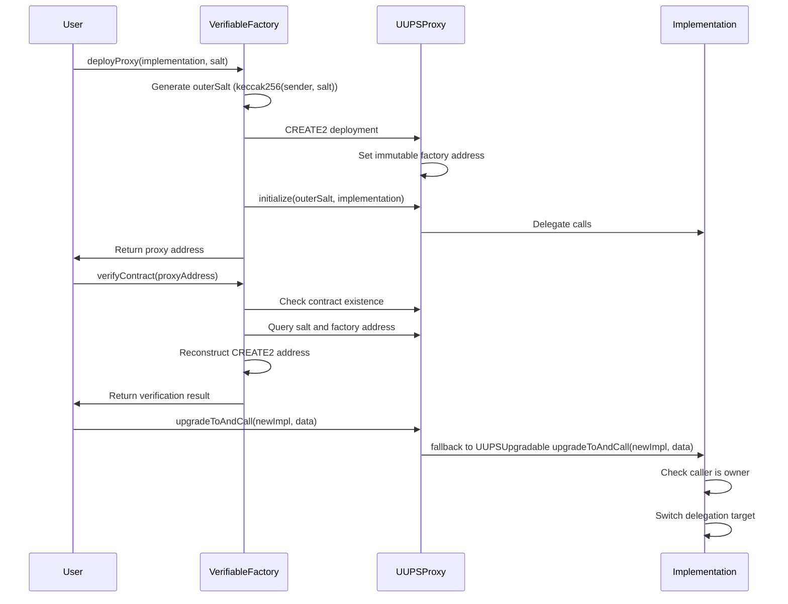

# Verifiable Factory Contract

A system for deploying and verifying proxy contracts with predictable storage layouts and deterministic addresses using CREATE2.

## Components

### 1. Verifiable Factory Contract
- Deploys Verifiable UUPSProxy instances using CREATE2 opcode
- Handles on-chain verification of deployed proxies
- Manages proxy upgrades through a secure ownership model
- Uses deterministic salt generation for predictable addresses

### 2. Verifiable UUPSProxy
- UUPS proxy pattern with verified storage layout
- Fixed storage slots via [SlotDerivation](https://docs.openzeppelin.com/contracts/5.x/api/utils#SlotDerivation) under `proxy.verifiable` namespace
  - `salt` (uint256)
- Immutable `verifiableProxyFactory` field (set in bytecode)
- Implements secure upgrade mechanism via UUPSUpgradable
- Initializable to prevent implementation tampering

## Architecture



## Implementation Guide

### Requirements
1. Inherit UUPS compliance:
```solidity
import "@openzeppelin/contracts-upgradeable/proxy/utils/UUPSUpgradeable.sol";

contract MyContract is UUPSUpgradeable {

  // ..rest of your own implementation
```

2. Use initializer instead of constructor:
```solidity
import "@openzeppelin/contracts-upgradeable/proxy/utils/Initializable.sol";

contract MyContract is Initializable, UUPSUpgradeable {
    // Implementation must follow UUPS upgrade pattern requirements

    function initialize() public initializer {
        // Initialize inherited UUPS contract
        __UUPSUpgradeable_init()
    }

    // ..rest of your own implementation
```

3. Implement upgrade authorization:
```solidity
import "@openzeppelin/contracts-upgradeable/access/OwnableUpgradeable.sol";

contract MyContract is UUPSUpgradeable, OwnableUpgradeable {

    // Mandatory security measure - define who can upgrade the contract
    // This function is executed on the CURRENT implementation (old contract)
    // during the upgrade process. It verifies permissions before switching implementations.
    function _authorizeUpgrade(address newImplementation) internal override onlyOwner {}

    // ..rest of your own implementation
```

### Example Implementation

```solidity
// SPDX-License-Identifier: MIT
pragma solidity ^0.8.20;

// Required UUPS imports
import "@openzeppelin/contracts-upgradeable/proxy/utils/UUPSUpgradeable.sol";
import "@openzeppelin/contracts-upgradeable/access/OwnableUpgradeable.sol";

contract MyImplementationV1 is UUPSUpgradeable, OwnableUpgradeable {
    
    uint256 public value;

    // Initialization replaces constructor functionality
    function initialize(address owner, uint256 initialValue) public initializer {
        // Initialize parent contracts first
        __Ownable_init(owner);       // Sets initial owner
        __UUPSUpgradeable_init();    // Required UUPS initialization
        
        // Custom initialization logic
        value = initialValue;
    }

    // Critical security function - defines upgrade permissions
    // Using onlyOwner modifier ensures only the designated owner can authorize contract upgrades
    function _authorizeUpgrade(address newImplementation) internal override onlyOwner {}

    // ..rest of your own implementation
}
```

### Example Implementation Upgrade

```solidity
// SPDX-License-Identifier: MIT
pragma solidity ^0.8.20;

import "./MyImplementationV1.sol";

contract MyImplementationV2 is MyImplementationV1 {

    uint256 public value;
    
    function postUpgradeSetup(uint256 upgradedValue) external onlyOwner {
        value = upgradedValue;
    }
}
```

### Post-Upgrade Hooks

To execute logic after an upgrade, use `data` parameter in `upgradeToAndCall` pattern.

The `upgradeToAndCall` pattern allows executing any function on the new implementation:
- Calls are made via `DELEGATECALL` from the proxy, so `msg.sender` will refer to the original sender in hook functions, while `address(this)` will refer to the proxy address.
- Storage modifications affect the proxy's state
- Caller must follow the authorization rules as implemented in the implementation contract

```solidity
// initial values based on example implementation
// address owner = address(0x..)
// uint256 initialValue = 6174; 

// In your deploy script
bytes memory initData = abi.encodeWithSelector(MyImplementationV1.initialize.selector, owner, initialValue);
address proxyAddress = factory.deployProxy(address(implementation), salt, initData);

MockRegistryV1 proxyV1 = MockRegistryV1(proxyAddress);

// uint256 upgradedValue = 1729;

// In your upgrade script (owner wallet calls)
bytes memory callData = abi.encodeWithSelector(MyImplementationV2.postUpgradeSetup.selector, upgradedValue);
proxyV1.upgradeToAndCall(address(newImplementation), callData);
```
