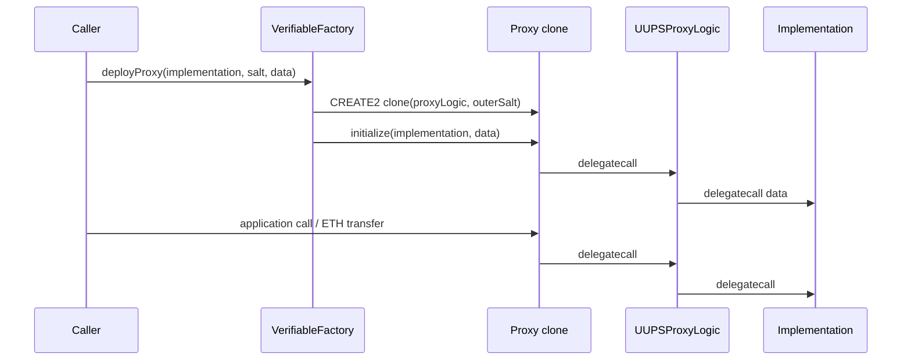
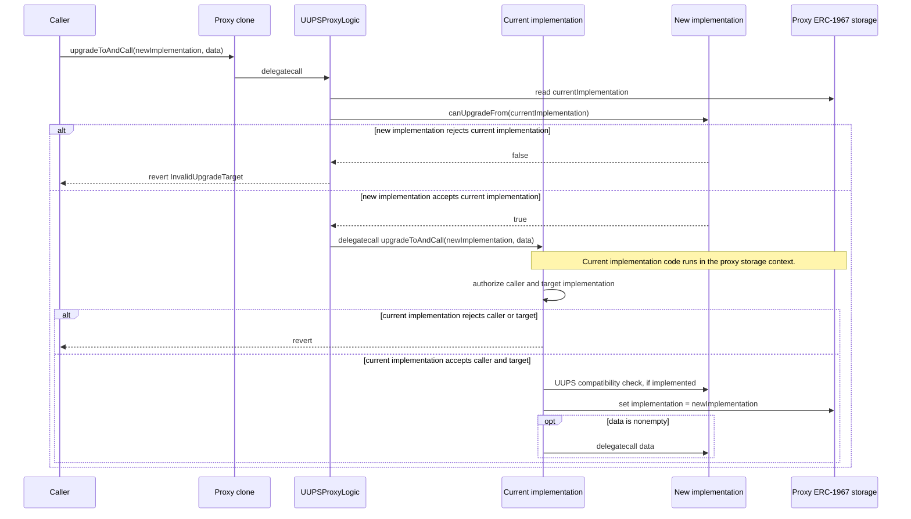

# Verifiable Factory

This repo contains a `CREATE2` factory for deterministic, verifiable, UUPS-compatible proxy clones.

The factory deploys one shared `UUPSProxyLogic` contract. Each proxy is a minimal clone that delegates proxy bookkeeping to that shared logic, while keeping its own ERC-1967 implementation slot. The clone runtime also carries the derived salt, which lets the factory verify later that a proxy address came from this factory.


```mermaid
sequenceDiagram
    participant Caller
    participant Factory as VerifiableFactory
    participant Clone as Proxy clone
    participant Logic as UUPSProxyLogic
    participant Impl as Implementation

    Caller->>Factory: deployProxy(implementation, salt, data)
    Factory->>Clone: CREATE2 clone(proxyLogic, outerSalt)
    Factory->>Clone: initialize(implementation, data)
    Clone->>Logic: delegatecall
    Logic->>Impl: delegatecall data
    Caller->>Clone: application call / ETH transfer
    Clone->>Logic: delegatecall
    Logic->>Impl: delegatecall
```

## Deploying

`deployProxy(implementation, salt, data)` does four things:

- derives `outerSalt = keccak256(abi.encode(msg.sender, salt))`
- deploys clone bytecode for `factory.proxyLogic()` with `outerSalt` appended to the runtime
- stores `implementation` in the clone's ERC-1967 implementation slot
- delegatecalls `data` into `implementation` if `data` is nonempty

The proxy address is deterministic for a given factory, shared logic address, caller, and user salt:

```solidity
bytes32 outerSalt = keccak256(abi.encode(caller, userSalt));
bytes memory bytecode = CloneProxyBytecode.creationCode(factory.proxyLogic(), outerSalt);
address proxy = Create2.computeAddress(outerSalt, keccak256(bytecode), address(factory));
```

The caller is part of `outerSalt`, so two callers can use the same user salt without colliding.

## Verifying

`verifyContract(proxy, expectedImplementation)` checks that:

- `proxy` has code
- `proxy` returns verifiable proxy data
- the current implementation is `expectedImplementation`
- the proxy address matches this factory's `CREATE2` derivation for the returned salt

That proves the address was deployed by this factory and currently points at the expected implementation. It does not prove the implementation is safe, audited, storage-compatible with old versions, or still on its original implementation. After an upgrade, verify against the new current implementation.

## Upgrading

Upgrades are started by calling `upgradeToAndCall(newImplementation, data)` on the proxy.


```mermaid
sequenceDiagram
    participant Caller
    participant Clone as Proxy clone
    participant Logic as UUPSProxyLogic
    participant Current as Current implementation
    participant New as New implementation
    participant Storage as Proxy ERC-1967 storage

    Caller->>Clone: upgradeToAndCall(newImplementation, data)
    Clone->>Logic: delegatecall
    Logic->>Storage: read currentImplementation
    Logic->>New: canUpgradeFrom(currentImplementation)
    alt new implementation rejects current implementation
        New-->>Logic: false
        Logic-->>Caller: revert InvalidUpgradeTarget
    else new implementation accepts current implementation
        New-->>Logic: true
        Logic->>Current: delegatecall upgradeToAndCall(newImplementation, data)
        Note over Current,Storage: Current implementation code runs in the proxy storage context.
        Current->>Current: authorize caller and target implementation
        alt current implementation rejects caller or target
            Current-->>Caller: revert
        else current implementation accepts caller and target
            Current->>New: UUPS compatibility check, if implemented
            Current->>Storage: set implementation = newImplementation
            opt data is nonempty
                Current->>New: delegatecall data
            end
        end
    end
```

There are two upgrade checks:

- the new implementation's `canUpgradeFrom(currentImplementation)` says whether this upgrade path is allowed
- the current implementation's `upgradeToAndCall(newImplementation, data)` decides whether this caller may perform this specific upgrade

With OpenZeppelin `UUPSUpgradeable`, the current implementation's decision point is
`_authorizeUpgrade(address newImplementation)`. That hook receives the target implementation address, so the current
implementation can block a specific target by reverting.

If an implementation does not use OpenZeppelin `UUPSUpgradeable`, it must still expose a compatible
`upgradeToAndCall(address newImplementation, bytes data)` function. That function is where the current implementation
must authenticate the caller, reject disallowed target implementations, write the ERC-1967 implementation slot, and run
any post-upgrade call data.

## Implementations

Implementations should use OpenZeppelin `UUPSUpgradeable` and must implement `IProxyAuthorization`:

```solidity
interface IProxyAuthorization {
    function canUpgradeFrom(address previousImplementation) external view returns (bool);
}
```

Usually `canUpgradeFrom` is just an allowlist of previous implementation addresses:

```solidity
contract MyImplementation is UUPSUpgradeable, OwnableUpgradeable, IProxyAuthorization {
    address public allowedPreviousImplementation;
    address public allowedUpgradeTarget;
    uint256[48] private __gap;

    function initialize(address owner) public initializer {
        __Ownable_init(owner);
        __UUPSUpgradeable_init();
    }

    function canUpgradeFrom(address previousImplementation) external view returns (bool) {
        return previousImplementation == allowedPreviousImplementation;
    }

    function _authorizeUpgrade(address newImplementation) internal override onlyOwner {
        require(newImplementation == allowedUpgradeTarget, "Upgrade target not allowed");
    }
}
```

## Trust Model

An authorized upgrade means you trust both the new implementation and the `upgradeToAndCall` payload. The post-upgrade hook runs with `delegatecall` in the proxy's storage context, so it can write any proxy storage slot, including ERC-1967 slots.

Normal application calls are stricter. `UUPSProxyLogic` checks the ERC-1967 implementation slot after non-upgrade fallback calls and reverts if the implementation changed.

## Storage

The implementation address uses the standard ERC-1967 slot:

```text
0x360894a13ba1a3210667c828492db98dca3e2076cc3735a920a3ca505d382bbc
```

The verification salt is not stored in proxy storage. It is appended to the clone runtime bytecode and returned by `getVerifiableProxyData()`.

Implementation upgrades still need normal upgradeable-contract storage layout discipline: append new variables instead of reordering existing ones, and use storage gaps or namespaced storage for contracts that may need future base-contract storage.

## Development

```sh
forge test
```
